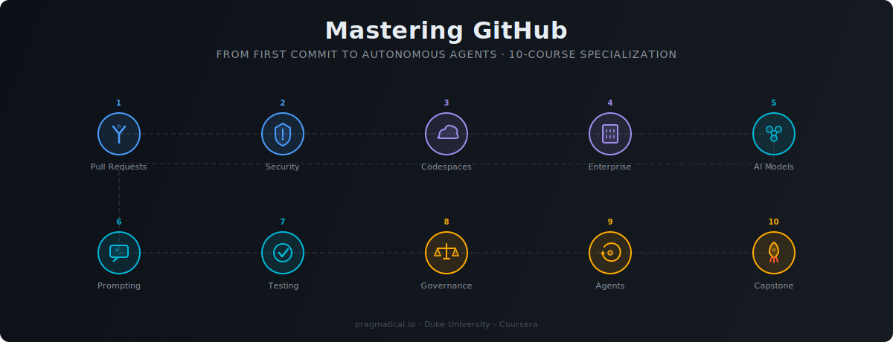

# Mastering GitHub

  

**From First Commit to Autonomous Agents** — a 10-course Coursera specialization
that takes you from zero GitHub experience through AI-assisted development to
building autonomous agent workflows.

## Courses

| # | Course | Focus | Capstone |
|---|--------|-------|----------|
| 1 | **From Zero to Pull Request** | Git workflow, branches, merges, issues, forks | TBD |
| 2 | **Security, Identity, and Access** | 2FA, SSH keys, repository visibility, org policies | [Project](capstones/c02-capstone.md) |
| 3 | **Codespaces, Actions, and Ecosystem Tools** | Cloud IDEs, GPU instances, CI/CD, Copilot | [Project](capstones/c03-capstone.md) |
| 4 | **Enterprise Administration Across Seven Domains** | Org management, RBAC, compliance, audit logs | TBD |
| 5 | **Evaluating and Integrating AI Models** | GitHub Models, API tokens, model comparison | TBD |
| 6 | **Advanced Prompt Engineering for Code** | Multi-file context, slash commands, Copilot Chat | TBD |
| 7 | **AI-Augmented Testing and Refactoring** | Test generation, code review, refactoring patterns | TBD |
| 8 | **Governing AI-Generated Code** | Security audit, license compliance, responsible AI | TBD |
| 9 | **Autonomous Agent Workflows** | Copilot agents, MCP, multi-step automation | TBD |
| 10 | **Production Application Capstone** | End-to-end project integrating all specialization skills | TBD |

## Structure

Each course is ~60 minutes of 3–5 minute videos organized as:

**Course → Module → Lesson (3–5 videos) → Key Terms + Reflection**

Every module ends with a **Critical Thinking Assessment** (quiz + role-play practice assignment).

## Instructors

- **Noah Gift** — Founder, Pragmatic AI Labs · Duke University
- **Alfredo Deza** — Author and content creator · Python, Rust, DevOps, ML

## License

Course content copyright Pragmatic AI Labs. Code examples are MIT licensed.
